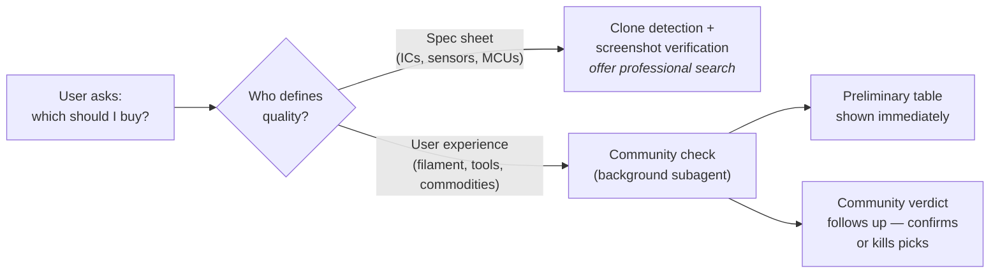

<div align="center">

# taobao

**Making an AI agent a competent Taobao operator — persistent login,
structured extraction, and walls surfaced instead of fought.**

Search, inspect, and extract structured product data from
`s.taobao.com` / `item.taobao.com` / `detail.tmall.com` through a
persistent, logged-in Chromium profile — no brittle CSS selectors,
no headless-detection roulette. Trust signals and community-verified
buying decisions layer on top.

The skill is deliberately read-only: it never modifies carts, messages
sellers, enters checkout, or places orders.

It also contains a read-only Xianyu/Goofish sourcing submode. That path is
inactive unless the user supplies the exact standalone, case-sensitive token
`Ultrasource`; `scripts/ultrasource.sh` repeats the check before browser or
network work. See [`references/ultrasource.md`](references/ultrasource.md).

[](assets/taobao-agent-adapter)
[](assets/taobao-agent-adapter/src/taobao/browser.ts)
[](#development)
[](references/browsers.md)
[](SKILL.md)

</div>

---

## What it focuses on

**The core problem is making an agent a competent Taobao operator at all.**
Taobao is actively hostile to automation: login walls, slider CAPTCHAs,
headless-browser detection, personalized re-ranking between identical
queries, and an SSR payload that drifts without notice. Most scraping
approaches die within a week. The skill's answer is a set of deliberate
mechanics:

- **A persistent, logged-in Chromium profile** attached over CDP — the
  agent drives the user's real, visible browser session instead of
  fighting headless detection, and the login survives across sessions
  and re-installs.
- **SSR-first extraction** — detail pages are read from the same
  `__ICE_APP_CONTEXT__` data the page rendered from, not from CSS
  selectors that break on every UI experiment; DOM scraping is only the
  fallback, and `ssrSource` tells you which path produced the data.
- **Walls surfaced, never fought** — CAPTCHA / login walls short-circuit
  with `requiresUserAction: true` and a screenshot for the user, instead
  of the agent spinning on selectors that will never resolve.
- **Agent-sized structured output** — typed candidate fields the agent
  can filter and score without re-parsing raw text, `--brief` to keep a
  46-candidate response inside tool-output limits, `href`-stable
  navigation because result indices re-rank between calls.

With extraction reliable, the skill adds two evidence layers for buying
decisions — because **listing metrics measure fulfilment, not product
quality**. A shop can ship a mediocre product quickly and politely for
years and keep a 4.8+ rating:

| Layer | Question it answers | Mechanism |
|---|---|---|
| **Structured extraction** (the foundation) | What is on offer, at what price, from whom? | SSR-first parsing, DOM fallback, typed candidate fields |
| **Trust & authenticity signals** | Can I trust this listing? | `platform` tier, `previouslyBought`, `shopAgeYears`, seller scorecard, `suspectClone` detection, full-page screenshots for silkscreen verification |
| **Community sentiment cross-check** | Is the product actually good? | Bilibili review-video comment sections, independent roundups — run as a background subagent so it never blocks the answer |

Which layers apply depends on *who defines quality*:



The two-phase delivery matters: the Taobao table is ready in seconds, the
community sweep costs minutes. The agent presents the candidate table
immediately (marked *preliminary*), launches the sweep in the background,
and follows up with the verdict — including picks the community evidence
killed and dark-horse brands the search never surfaced.

## When to use it

- **Source electronic components** by part number — live offers, shop
  reputation, prices, stock, and package/silkscreen verification via
  screenshots before committing.
- **Buy brand-differentiated commodities** (3D-printing filament, tools,
  power supplies) — where listing data alone routinely ranks a
  community-condemned product #2, and the cross-check catches it.
- **Compare vendors** for the same SKU across price, credibility,
  delivery, and counterfeit risk.
- **Inspect a specific listing** by URL — structured price / shop / SKU /
  image data plus a persistent full-page screenshot.
- **Triage Chinese-clone parts** — titles carrying domestic-clone vendor
  suffixes (`-HXY`, `-CMSEMICON`) or marketing tells (`平替`,
  `国产替代`) are flagged automatically.

It is *not* a scraping framework, an anti-bot toolkit, or a synchronous
storefront API. CAPTCHA / verification walls are surfaced to the user with
a screenshot — never solved automatically.

## Quick start

Install with one command via [`degit`](https://github.com/Rich-Harris/degit).
Claude Code:

```bash
mkdir -p ~/.claude/skills
npx -y degit yuxiangcheng2002/taobao-skill ~/.claude/skills/taobao
```

Codex:

```bash
mkdir -p "$HOME/.agents/skills"
npx -y degit yuxiangcheng2002/taobao-skill "$HOME/.agents/skills/taobao"
```

Restart the agent runtime, then ask for anything Taobao-shaped — *"set up
taobao"*, *"search Taobao for ESP32"*. The agent will:

1. Run `./scripts/taobao.sh setup` — verifies Node, npm, browser, Gatekeeper.
2. Run `./scripts/taobao.sh browser-start` — pauses once for you to log
   into Taobao in the dedicated window.
3. Run `./scripts/taobao.sh probe-attached` — confirms the session is live.
4. Proceed with what you actually asked for.

Full install details (offline / tarball fallback): [`INSTALL.md`](INSTALL.md).
Per-OS browser-trust quirks: [`references/browsers.md`](references/browsers.md).
Agent runtime guidance: [`SKILL.md`](SKILL.md) and
[`references/workflow.md`](references/workflow.md). Gated Xianyu sourcing:
[`references/ultrasource.md`](references/ultrasource.md).
Test design and release gates: [`references/evaluation.md`](references/evaluation.md).

## Action reference

Ordinary Taobao actions go through `./scripts/taobao.sh <action> [args...]`.
Xianyu actions go only through
`./scripts/ultrasource.sh Ultrasource <action> [args...]`. The canonical
references with per-action caveats live in
[`references/workflow.md`](references/workflow.md).

| Action | Purpose |
|---|---|
| `setup` | First-time check / browser picker (TTY menu or `--browser <path>`) |
| `doctor` | Build + JSON environment summary |
| `test` | Run the adapter unit tests |
| `verify` | Required deterministic release gate with auditable evidence |
| `e2e-live [outputDir]` | Optional read-only live health check (`pass/fail/blocked/drift`) |
| `browser-start` / `-status` / `-stop` | Lifecycle of the dedicated Chromium |
| `probe` / `probe-attached` | Visit `taobao.com`, report state + authoritative login status |
| `search` / `search-attached <query> [--brief]` | Structured search candidates |
| `open-result` / `-attached <query> <index>` | Re-search and open the Nth candidate |
| `open-href` / `-attached <url>` | Open a specific URL — index-stable, preferred |
| `visual-open-attached <url> [--brief]` | Stage one owned foreground tab for Codex Computer Use |
| `visual-resume-attached [--brief]` | Observe that staged tab once after user clears a wall |
| `visual-close-attached` | Close only the marker-owned visual tab |
| `download-images` / `-attached <query> <index>` | Save the listing's gallery |
| `ultrasource Ultrasource <search\|open-href\|e2e-live>` | Exact-token-gated Xianyu submode; prefer `scripts/ultrasource.sh` directly |

The `*-attached` variants reuse the persistent logged-in profile via CDP —
and they all drive the **same** browser, so run them strictly one after
another. Two attached commands in flight at once navigate over each other
and fail with `ERR_ABORTED`; each returns in seconds, so parallelizing
buys nothing.

Two flags matter in agent contexts:

- **`--brief`** (`search`, `open-result`, `open-href`, `visual-open`,
  `visual-resume`) drops the verbose
  `networkTap` diagnostics from the JSON — a 46-candidate search shrinks
  to ~13 KB instead of blowing past tool-output limits and truncating the
  candidates that matter. Omit it only when diagnosing session/wall
  issues, since the tap is where `SESSION_EXPIRED` and CAPTCHA redirects
  show up.
- **`--no-screenshot`** (`open-result`, `open-href`) skips the full-page
  PNG (~0.5–1.5 MB per call) when only structured fields are needed.
  Keep screenshots **on** for ICs — silkscreen verification is
  non-negotiable there.

Codex desktop can add a bounded live-UI corroboration pass after structured
extraction. Read [`references/codex-computer-use.md`](references/codex-computer-use.md)
before using the `visual-*` actions. The adapter remains primary; Computer Use
may inspect and scroll the owned tab, never drive shopping controls.

And one standalone helper:

```bash
./scripts/bilibili-comments.sh <BV-id> [max-comments]
```

pulls the top comments (plus nested replies, sorted by likes) of any
Bilibili video without login — the raw material of the community check.
Locate videos with a web search scoped to `site:bilibili.com`; the
Bilibili search API requires wbi signing and is deliberately not used.

## Community sentiment cross-check

The playbook lives in
[`references/community-check.md`](references/community-check.md). The short
version:

- **Trigger** — the user asks *which to buy* and the answer hinges on how
  the product performs (materials, tools, commodities with brand-level
  quality differences). Price-only or logistics-only questions skip it.
- **Exception** — globally-standardized professional parts (ICs, sensors,
  MCUs, passives) are judged by datasheet compliance and authenticity,
  not Chinese community sentiment. For those the skill relies on
  `suspectClone` + screenshot verification and offers a generic
  professional search (datasheets, errata, international forums) instead.
- **Sources, ranked** — Bilibili comment sections first (owner long-term
  reports and UP主 replies carry the most weight), independent 口碑汇总
  roundups second. Zhihu zhuanlan praise pieces are treated as soft ads
  and weighted zero.
- **Delivery** — run as a background subagent; the preliminary Taobao
  table is never held back, and the verdict follows up explicitly.
  When community evidence contradicts the listing-data ranking, the
  recommendation is revised out loud — not quietly blended.

<details>
<summary><b>Case study: why this layer exists</b></summary>

A domestic PETG filament search surfaced a 14-year Tmall shop with 70k+
sales and a 5.0 shop rating — #2 by listing data. The community check then
found the reviewer of a seven-brand comparison replying, in his own
comment section, that this brand's professional test model *"完全不能成型"*
(completely failed to form). Meanwhile the comment sections repeatedly
nominated a dark-horse brand no listing query had surfaced. The final
recommendation inverted the listing-data ranking — and said so explicitly.

</details>

## Response schemas

<details>
<summary><b><code>search</code> — candidate fields</b></summary>

Canonical schema and fallback behaviour:
[`references/workflow.md`](references/workflow.md#structured-fields-on-search-candidates).
Each entry in `candidates[]`:

| Field | Source | Notes |
|---|---|---|
| `index`, `title`, `href` | DOM anchor | Stable handle for `open-href` |
| `price`, `sales`, `location` | rawText regex | Province whitelist for `location` |
| `shop` | rawText | Skips UI-chrome blacklist (`收藏的店铺`, `免费开店`, …) |
| `platform` | href + shop suffix | `taobao` / `tmall` / `tmall-flagship` |
| `previouslyBought` | rawText | True when listing carries `买过的店` / `我买过的宝贝` |
| `shopAgeYears` | rawText | Integer from `X年老店` |
| `tags` | rawText | `包邮`, `可开发票`, `对公支付`, `假一赔四`, `退货宝`, `公益宝贝`, `次日达`, `24小时内发`, `48小时内发`, `券后价`, `免运费` |
| `suspectClone` / `suspectReason` | title | Clone-vendor suffix (`-HXY`, `-CMSEMICON`) or marketing keyword |
| `thumbnailUrl` | DOM img | Search-result thumbnail |
| `rawText` | Full source string | For agents that want their own parsing |

Top-level: `state`, `url`, `loggedInLikely`, `candidateCount`,
`networkTap` (omitted with `--brief`), plus `screenshotPath` +
`requiresUserAction: true` when a CAPTCHA / login wall intercepts.

</details>

<details>
<summary><b><code>open-result</code> / <code>open-href</code> — detail fields</b></summary>

Full schema including SSR-vs-DOM fallback rules and the
`ICE_CONTEXT_PATH_DRIFT_SUSPECTED` warning condition:
[`references/workflow.md`](references/workflow.md#ssr-injected-detail-data-__ice_app_context__).
`detail` carries:

| Field | Primary source | Notes |
|---|---|---|
| `price`, `priceTitle` | `componentsVO.priceVO.price` (SSR) | DOM regex fallback |
| `shop`, `shopId`, `sellerId` | `seller` (SSR) | DOM blacklist + head fallback |
| `sellerEvaluates` | `seller.evaluates` (SSR) | Three-row scorecard: 宝贝描述 / 卖家服务 / 物流服务 |
| `sales` | `item.vagueSellCount` (SSR) | Cumulative, not 30-day |
| `quantity`, `quantityText` | `skuCore.sku2info["0"]` (SSR) | Live stock count + display string |
| `productImageUrls` | `item.images` ∩ chrome-filter | Up to 5 curated, primary `item_pic` |
| `imageUrls` | DOM `` scan | Full set; `productImageUrls` is the curated subset |
| `priceTiers`, `moq` | rendered text | Best-effort, often empty |
| `screenshotPath` | Playwright | Full-page PNG under `downloads/screenshots/` |
| `ssrSource` | Adapter | `"ice-context"` when SSR drove primary fields, else `"dom"` |
| `warnings` | Adapter | Non-fatal advisories, e.g. SSR-drift suspicion |
| `requiresUserAction` | state inference | True when a verification / login wall intercepted |
| `rawTextPreview` | `body.innerText()` | First 1200 chars, for ad-hoc parsing |

`picked` mirrors the search-candidate shape so callers can treat
`open-href` and `open-result` symmetrically.

</details>

## Worked examples

### Sourcing an IC (spec-sheet-defined — no community sweep)

```bash
./scripts/taobao.sh search-attached "ICM-42688-P" --brief
```

The structured fields make the buying patterns explicit:

- **Tmall flagship** — `platform: 'tmall-flagship'`, tags like `假一赔四`
  and `可开发票`. Highest guarantee tier; the pick when invoicing or
  counterfeit indemnity matters. Runs ~30–60% above the cheapest stalls.
- **Previously-bought shop** — `previouslyBought: true`; lower price,
  real personalized trust signal.
- **Clone** — `suspectClone: true`, `suspectReason: 'suffix:-HXY'`.
  The `-HXY` suffix marks the 华轩阳 domestic clone of TDK's ICM IMUs
  (LGA-14 vs TDK's QFN-14, ¥7–12 vs ¥30+). Register-similar, but drift /
  noise / temperature behaviour are not 1:1 — a second source, not a
  drop-in.

Then open the pick **with** a screenshot and read the PNG to confirm the
package and silkscreen match the datasheet (`I428P` / `1428P` on QFN-14):

```bash
./scripts/taobao.sh open-href-attached "<href from search candidate>"
```

### Buying filament (experience-defined — community sweep applies)

Same search mechanics, different verification: the agent presents the
candidate table immediately (marked preliminary), spawns the background
community check for the shortlisted brands, and follows up minutes later
with which picks survived the comment sections — no extra user prompt
needed.

Vendor-specific trust calls (which flagships are best for which brands,
which stalls shipped good batches) belong in
`~/.taobao-agent/PREFERENCES.md` — per-user, outside the skill.

## Architecture

The skill folder holds **only code and documentation** — read-only,
re-extractable, replaceable. All user state (login cookies, screenshots,
browser config, personal preferences) lives under `~/.taobao-agent/`.

<details>
<summary><b>Directory layout</b></summary>

```
~/.claude/skills/taobao/                  (the skill — code + docs only)
├── SKILL.md                              # Skill manifest — agent-facing summary
├── README.md                             # This file
├── INSTALL.md                            # Bootstrap steps for tarball recipients
├── scripts/
│   ├── taobao.sh                         # Wrapper: cd into adapter, run npm scripts
│   ├── ultrasource.sh                    # Exact-token gate for Xianyu actions
│   ├── setup.sh                          # First-time environment / browser picker
│   └── bilibili-comments.sh              # Community check: pull video comments, no login
├── references/
│   ├── workflow.md                       # Agent runbook (actions, fields, fallbacks)
│   ├── ultrasource.md                    # Gated Xianyu sourcing + safety boundary
│   ├── community-check.md                # Sentiment cross-check playbook + subagent template
│   └── browsers.md                       # Per-OS install / trust notes
└── assets/taobao-agent-adapter/          # Bundled TypeScript adapter
    ├── src/
    │   ├── cli.ts                        # CLI entrypoint (--brief, --no-screenshot)
    │   ├── taobao/
    │       ├── adapter.ts                # search / openResult / openByHref / mtop login probe
    │       ├── browser.ts                # CDP attach + persistent-context launch
    │       ├── parser.ts                 # Candidate field extraction + clone detection
    │       ├── network.ts                # Best-effort response capture
    │       ├── state.ts                  # Page-state inference (home / search / detail / wall)
    │       ├── config.ts                 # Project root, data dir, browser path
    │       └── types.ts                  # Shared response shapes
    │   └── xianyu/                       # Ultrasource parser, adapter, CLI, types
    └── scripts/remote-browser.sh         # Start / stop / status the dedicated Chromium

~/.taobao-agent/                          (user data — survives skill re-installs)
├── config.sh                             # Persisted CHROMIUM_PATH (written by setup)
├── PREFERENCES.md                        # Per-user vendors, defaults, learned heuristics
├── profiles/taobao-chromium/             # Persistent browser profile — login lives here
├── playwright/                           # remote-browser.sh launch log
└── downloads/
    ├── screenshots/                      # PNGs from open-result / open-href
    └── galleries/                        # Image dumps from download-images
```

</details>

`TAOBAO_PROJECT_DIR` points at an external adapter checkout when iterating;
`TAOBAO_DATA_DIR` overrides where user state lives.

## Design decisions worth knowing

- **Authoritative login detection via signed mtop call** — the adapter
  asks `mtop.user.getUserSimple` (standard client-side
  `md5(token&t&appKey&data)` sign) from the page context whether the
  *session* is alive. The old cookie heuristic false-positived because
  `tracknick` is a remembered nick that survives session expiry. The
  heuristic remains only as a fallback when the mtop probe is
  inconclusive.
- **User state under `~/.taobao-agent/`, not in the skill folder** — the
  skill stays read-only and re-extractable; login state survives
  re-installs. Setup auto-migrates pre-2026-05 in-skill layouts.
- **Attached browser via CDP, not headless** — keeps the user logged in,
  avoids headless-detection, makes CAPTCHAs visually obvious.
- **`open-href` over `open-result`** — search results re-rank between
  calls (ad slots, personalization). The `href` is stable; the index is
  not.
- **SSR `__ICE_APP_CONTEXT__` over DOM scraping** — detail pages embed
  canonical product data at `loaderData.home.data.res`; the adapter reads
  what the page rendered from, with DOM scraping as silent fallback and
  `ssrSource` flagging which path produced the data.
- **Background tab creation via raw CDP** — `context.newPage()` steals
  macOS focus on every action; the adapter issues
  `Target.createTarget({background: true})` instead.
- **Verification walls short-circuit** — `requiresUserAction: true` plus
  a screenshot of the wall, instead of spinning on selectors that will
  never resolve.
- **Community check runs beside the answer, not in front of it** — the
  user reads the preliminary table while the subagent sweeps; the
  verdict arrives as a follow-up, and contradictions are stated, not
  blended.

## Limitations

- **Mtop search-API tap is not implemented** — search results are already
  SSR-rendered into the HTML; a direct mtop search call would need
  client-side `sign` computation against a moving signature for little
  payoff over `search` + `open-href`.
- **`priceTiers` / `moq`** rarely appear in the rendered body; tier
  pricing usually hides in the SKU panel behind a click.
- **Detail-page `shop` extraction** is heuristic (anchor blacklist, then
  head-of-rawText scan) — extend `SHOP_NAME_BLACKLIST` in `parser.ts`
  when new UI chrome sneaks past.
- **The `__ICE_APP_CONTEXT__` path will drift** with Taobao SSR bumps;
  the DOM fallback is silent by design (a missing field beats a wrong
  one).
- **City-only listings** are not extracted into `location` — the
  whitelist is province / SAR-level.
- **Bilibili comment pulls** depend on an unauthenticated public API;
  if it gains signing requirements, the community check falls back to
  web-search snippets.

## Development

```bash
cd assets/taobao-agent-adapter
npm install                  # auto-runs on first wrapper invocation
npm run build                # tsc -p tsconfig.json
npm test                     # unit, URL/state, trigger, and adapter-contract tests
npm run smoke:doctor         # JSON env summary
```

The wrapper handles `cd` and `npm run` when called through
`./scripts/taobao.sh`; any wrapper action triggers a rebuild.

When adding extraction logic:

- New search-candidate fields → `parser.ts` (`summarizeCandidate`) +
  `types.ts` (`ProductSummary`); add a unit test.
- New detail fields from SSR → `adapter.ts` (`extractIceContextDetail`) +
  `types.ts` (`ProductDetail`).
- New tag / clone keyword → `TAG_PATTERNS` / `CLONE_KEYWORD_PATTERNS` /
  `CLONE_SUFFIX_PATTERNS` in `parser.ts`.

Network-traffic debugging: `networkTap` carries the most recent ~12–15
captured responses; URLs matching `mtop.taobao.detail.getdetail`,
`…getdesc`, or `…pcdetail.*` include their full body (capped at 200 KB)
in `fullBody`.

## Cross-references

| Document | Role |
|---|---|
| [`SKILL.md`](SKILL.md) | Agent-facing manifest — setup walkthrough, rules, community-check trigger |
| [`references/workflow.md`](references/workflow.md) | Runbook — actions, structured fields, SSR notes, output ergonomics |
| [`references/community-check.md`](references/community-check.md) | Sentiment cross-check playbook, source trust ranking, subagent template |
| [`references/browsers.md`](references/browsers.md) | Per-OS browser install / trust notes |
| [`INSTALL.md`](INSTALL.md) | Bootstrap for tarball recipients |
